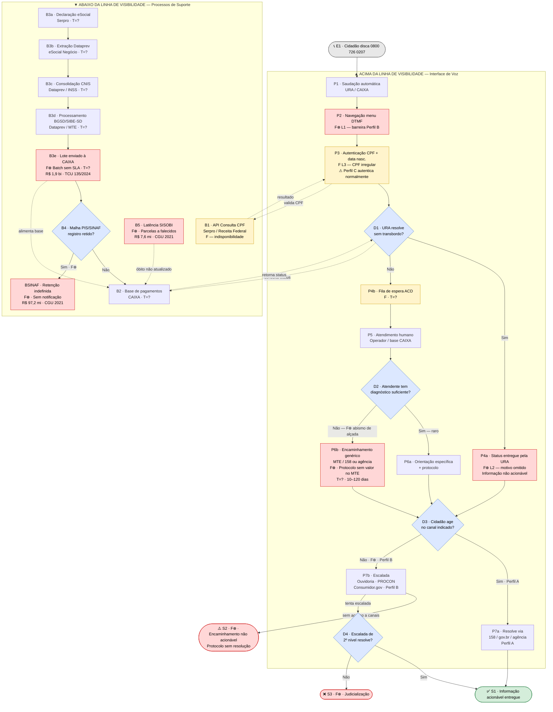

# Diagrama AS-IS — Jornada de Atendimento ao Seguro-Desemprego
## Service Blueprint via URA/0800 CAIXA (Shostack, 1984)
### Parte D — Diagrama de Relações

> Gerado a partir dos itens identificados na Parte C (`C_blueprint_asis.md`).
> Renderiza diretamente no GitHub com Mermaid.

---

## Legenda de Cores

| Cor | Tipo de Nó |
|:---|:---|
| Vermelho claro | F⊗ — Fail point estrutural (falha de design) |
| Amarelo claro | F — Fail point contingente (falha de execução) |
| Azul claro | Losango de decisão (D1–D4, B4) |
| Verde claro | S1 — Saída com output cumprido |
| Vermelho claro | S2, S3 — Saídas com output não cumprido |
| Cinza | E1 — Entrada |

**Setas sólidas `-->` :** fluxo sequencial entre etapas
**Setas pontilhadas `-.->` :** conexões cruzando a linha de visibilidade (cidadão ↔ sistema)

---

## Diagrama

---

## Relações Explícitas Documentadas

As setas abaixo refletem os handoffs entre atores e etapas mapeados na Parte C:

| De | Para | Tipo | Significado |
|:--|:--|:--:|:--|
| E1 | P1 | `-->` | Cidadão inicia o serviço discando o 0800 |
| P3 | B1 | `-.->` | URA solicita validação do CPF à API Serpro |
| B1 | P3 | `-.->` | Serpro retorna resultado (válido / irregular / indisponível) |
| D1 | B2 | `-.->` | URA consulta base de pagamentos da CAIXA para retornar status |
| B2 | D1 | `-.->` | Base retorna status (disponível / bloqueado / não localizado) |
| B3a→B3e | — | `-->` | Batch pipeline: eSocial (Serpro) → Dataprev/eSocial Negócio → CNIS → BGSD/SIBE-SD → lote enviado à CAIXA |
| B3e | B2 | `-.->` | Lote de liquidação alimenta a base de pagamentos da CAIXA |
| B4 | BSINAF | `-->` | Registro retido na tabela SINAF: bloqueio indefinido sem notificação (F⊗) |
| B5 | B2 | `-.->` | Latência SISOBI: óbito não atualizado mantém parcela disponível na base CAIXA (F⊗) |
| D2 | P6b | `-->` | Atendente sem diagnóstico emite encaminhamento genérico (abismo de alçada — F⊗) |
| D3 | P7b | `-->` | Perfil B não consegue agir no canal indicado → escalada obrigatória (F⊗) |
| P7b | S2 | `-->` | Perfil B sem acesso a canais de escalada encerra sem resolução (F⊗) |
| D4 | S3 | `-->` | Escalada de 2º nível falha → judicialização (F⊗) |
